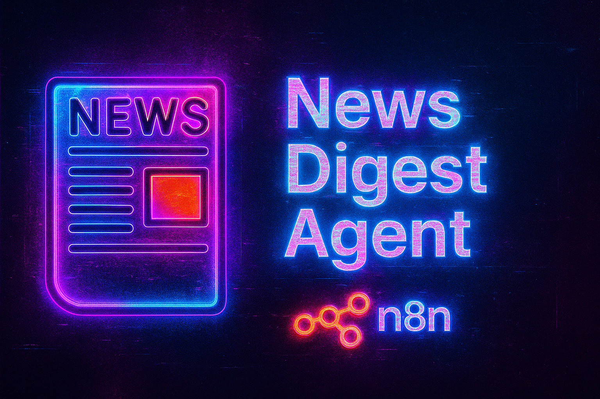

# 📰 News Digest Agent

[](https://n8n.io/)
[](https://opensource.org/licenses/MIT)
[](https://github.com/Wasif-Sohail55/News-Digest-Agent)

> Stay informed without the information overload! An automated solution that delivers curated news directly to your inbox.



## ✨ Overview

The **News Digest Agent** is an automated workflow built with [n8n](https://n8n.io/) that fetches the latest news on topics you care about, processes them intelligently, and delivers them straight to your email inbox on a schedule you define.

**No more endless scrolling through news sites!** 📱🚫

## 🚀 Features

| Feature | Description |
|---------|-------------|
| 🎯 **Topic-Based Filtering** | Customize exactly what news topics you want to follow |
| ⏰ **Scheduled Delivery** | Daily, weekly, or custom schedule options |
| 📊 **Smart Summarization** | Get the essence of the news without the fluff |
| 👥 **Multiple Recipients** | Share digests with your team, family or friends |
| 🔌 **Zero-Code Setup** | Built entirely with n8n's visual workflow editor |
| 🔄 **Fully Automated** | Set it up once and let it work for you |

## 🛠️ Tech Stack

<table>
  <tr>
    <td align="center"><br><sub><b>n8n</b></sub></td>
    <td align="center"><br><sub><b>Email</b></sub></td>
    <td align="center"><br><sub><b>News API</b></sub></td>
  </tr>
</table>

## 📂 Project Structure

```
News-Digest-Agent/
│── workflows/              # Exported n8n workflows (.json)
│── docs/                   # Screenshots, diagrams
│── README.md               # Project documentation
```

## 🚦 Getting Started

### Prerequisites

- [n8n](https://n8n.io/) installed (locally or cloud)
- News API key
- Email account for sending digests

### Installation Steps

#### 1️⃣ Clone the Repository

```bash
git clone https://github.com/Wasif-Sohail55/News-Digest-Agent.git
cd News-Digest-Agent
```

#### 2️⃣ Install n8n

**Option A: Using npm**
```bash
npm install n8n -g
n8n start
```

**Option B: Using Docker**
```bash
docker run -it --rm \
  --name n8n \
  -p 5678:5678 \
  -v ~/.n8n:/home/node/.n8n \
  n8nio/n8n
```

#### 3️⃣ Import Workflow

1. Open n8n in your browser: http://localhost:5678
2. Navigate to **Workflows** → **Import from File**
3. Select the workflow JSON from `/workflows/news-digest.json`

#### 4️⃣ Configure Credentials

1. Set up your **News API** credentials
   - Go to Credentials → Create New
   - Add your API key

2. Set up your **Email** credentials
   - Configure SMTP/Gmail/Outlook details

## ⚙️ Configuration

### Customize Your Topics

Edit the **HTTP Request** node to modify your news topics:

```json
{
  "topics": ["AI", "Technology", "Business", "Science"]
}
```

### Add Recipients

In the **Send Email** node, add your recipient list:

```
recipient1@example.com, recipient2@example.com
```

### Set Schedule

Configure the **Schedule Trigger** node:
- Daily digest: `0 8 * * *` (8:00 AM daily)
- Weekly digest: `0 9 * * MON` (9:00 AM every Monday)

## 🖼️ Screenshots

<details>
<summary>📌 View Workflow Example</summary>

</details>

<details>
<summary>📌 View Email Output Example</summary>

</details>

## 🗺️ Roadmap

- [ ] Add Telegram / Slack notification options
- [ ] Support for multiple news sources integration
- [ ] Generate daily summaries in PDF format
- [ ] Create interactive metrics dashboard
- [ ] Add sentiment analysis for news filtering

## 🤝 Contributing

Contributions make the open-source community amazing! Any contributions you make are **greatly appreciated**.

1. Fork the Project
2. Create your Feature Branch (`git checkout -b feature/AmazingFeature`)
3. Commit your Changes (`git commit -m 'Add some AmazingFeature'`)
4. Push to the Branch (`git push origin feature/AmazingFeature`)
5. Open a Pull Request

## 📝 License

Distributed under the MIT License. See `LICENSE` for more information.

## 📬 Contact

**Wasif Sohail** - [GitHub Profile](https://github.com/Wasif-Sohail55)

Email: wasifsohail66@gmail.com

Project Link: [https://github.com/Wasif-Sohail55/News-Digest-Agent](https://github.com/Wasif-Sohail55/News-Digest-Agent)

---

<p align="center">
  <sub>Built with ❤️ by Wasif Sohail</sub>
</p>
